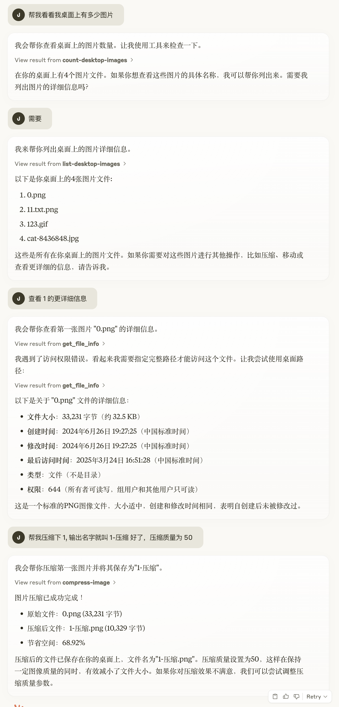

# Desktop Image Manager MCP Server

基于 Model Context Protocol (MCP) 开发的桌面图片管理服务器，提供图片文件统计、查看和压缩功能。

## 操作示例：
[](https://claude.ai/share/0ffbad1e-502e-4188-b008-0bb966acf06d)
[https://claude.ai/share/0ffbad1e-502e-4188-b008-0bb966acf06d](https://claude.ai/share/0ffbad1e-502e-4188-b008-0bb966acf06d)

## 功能特性

- 统计桌面图片数量：快速获取桌面上的图片文件总数
- 获取图片列表：列出桌面上所有图片文件的名称
- 图片压缩：支持压缩 JPG、PNG、WebP 等格式的图片文件，可自定义压缩质量

## 实现提示

让 Trae 引用 `./demand.md` 进行功能代码生成，简化版如下

```plaintext
... （这里是已经引入的 domain knowledge）

打造一个 MCP 服务器，它能够：
- 功能：
  - 统计当前桌面上的图片文件数量
  - 获取对应文件的名称
  - 支持压缩图片

要求：
- 不需要给出 prompt 和 resource 相关代码。
- 你可以假设我的桌面路径为 /Users/{username}/Desktop
```

## 支持的图片格式

- JPG/JPEG
- PNG
- GIF
- BMP
- WebP
- TIFF
- SVG

## 环境要求

- Node.js >= 16
- pnpm >= 8

## 安装

```bash
# 克隆项目
git clone <repository-url>
cd desktop-image-manager

# 安装依赖
pnpm install
```

## 开发

```bash
# 启动开发服务器
pnpm dev
```

## 构建和运行
```bash
# 构建项目
pnpm build

# 运行服务器
pnpm start
```

## 调试

```bash
# 调试 MCP 服务
pnpm inspector
```

## MCP 工具使用说明
### 1. 统计桌面图片数量
```bash
# 构建项目
pnpm build

# 运行服务器
pnpm start
```

### 2. 获取图片列表
```typescript
// 工具名称: list-desktop-images
// 参数: 无
await client.callTool({
  name: "list-desktop-images"
});
```

### 3. 压缩图片
```typescript
// 工具名称: compress-image
// 参数:
// - fileName: 要压缩的图片文件名
// - quality: 压缩质量 (1-100)，默认 80
// - outputName: 输出文件名（可选）
await client.callTool({
  name: "compress-image",
  arguments: {
    fileName: "example.jpg",
    quality: 75,
    outputName: "example-compressed.jpg"
  }
});
```

## 开发

```bash
# 启动开发服务器
pnpm dev
```

## 安装
使用 Claude Desktop 添加如下配置 config:

MacOS: ~/Library/Application Support/Claude/claude_desktop_config.json Windows: %APPDATA%/Claude/claude_desktop_config.json

```json
{
  "desktop-image-manager": {
      "command": "npx",
      "args": [
        "-y",
        "@jzone-mcp/desktop-image-manager-mcp"
      ]
    }
}
```

## 注意事项
1. 确保有足够的桌面访问权限
2. 大文件压缩可能需要较长时间
3. 压缩后的文件默认保存在桌面，文件名会添加 "-compressed" 后缀
## 技术栈
- TypeScript
- MCP SDK
- Sharp (图片处理)
- fs-extra (文件操作)
- zod (参数验证)


## 许可证
MIT License
```plaintext
这个 README 文件包含了项目的主要信息、安装说明、使用方法和注意事项。如果您需要添加或修改任何内容，请告诉我。
```